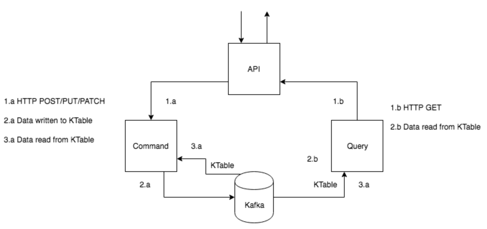

# Routing Service POC

This application demonstrates an architecture of a shipping routing service. 
It served as only a prove of concept to implement an event sourced system with
minimal flow of typical use case in cargo shipping business domain.

## Overview of Routing Business Model

In a typical scenario, a customer requests to ship one or many cargos. 
A request causes a creation of booking request by Booking microservice, 
a long with the associated cargos requested. As a result of adding a cargo to 
a shipping booking request, a domain event would publish and acted by this route
microservice. Knowing the origin location of a cargo and it final
destination, this service obtains proper shipping transportation routing 
and detail itinerary legs for each route.

Other downstream services in the system can react to events published by this routing service to, for instance,
create operation jobs (by operation services). the jobs cater tasks to different stakeholders in order to
perform actions in order to fulfill container logistics and assignment to fulfill the requested shipments.

Interactions with this routing service is also intended to project different 
analytics and summary data to serve different search criteria.

## The Architecture

Event based communication and sourcing is used in this architecture to handle
interactions and project various needed queryable data views. Separating service
clients' commands from auto-generated data projections pattern of CQRS is found
to be handy to achieve such goals.

The architecture consists of Spring-boot based microservics, mainly the command
service and query service. events are in JSON format to
easily serialize and deserialize between interested parties and even non-java based services.

External clients interact with the system via API gateway, that in turns uses commands to perform
actions on any of the entities via the "root" Route aggregate. Subsequently, domain events are published as 
a result of these interactions. Other services can listen to these domain events and project / aggregate 
needed data views.

Kafka messaging broker along with its KStream and KTable APIs are used in the POC. KStream 
listens to published domain events and keep any point-in-time snap-shops of the "root" Route aggregate
in a KTable to source it by the command service.

  

## Project Modules

This repository consists of these modules

* poc-route-common: Sharable domain, command and event models.
* poc-route-service-cmd: The command service to interact with the system (write-only purpose).
* poc-route-service-qry: The query service listens to command service's generated domain events to
project data views and serve to query these views.
* poc-route-gateway: API gateway serves as a proxy to the command and query services.

## Run Kafka Locally

 * [Download](https://kafka.apache.org/downloads) kafka
 
 * extract the downloaded file, and navigate to the kafka home directory
 
 *  run this command to bring up ZooKeeper
 ``` shell
 bin/zookeeper-server-start.sh config/zookeeper.properties 
 ```
 * run this command to bring up Kafka
 ```shell 
 bin/kafka-server-start.sh config/server.properties
 ``` 

## Run the Project Locally

* Clone this project.

* Run the command below inside poc-route-service-cmd, poc-route-service-qry and 
poc-route-service-gateway folders:
```bash
$ mvn spring-boot:run
```


